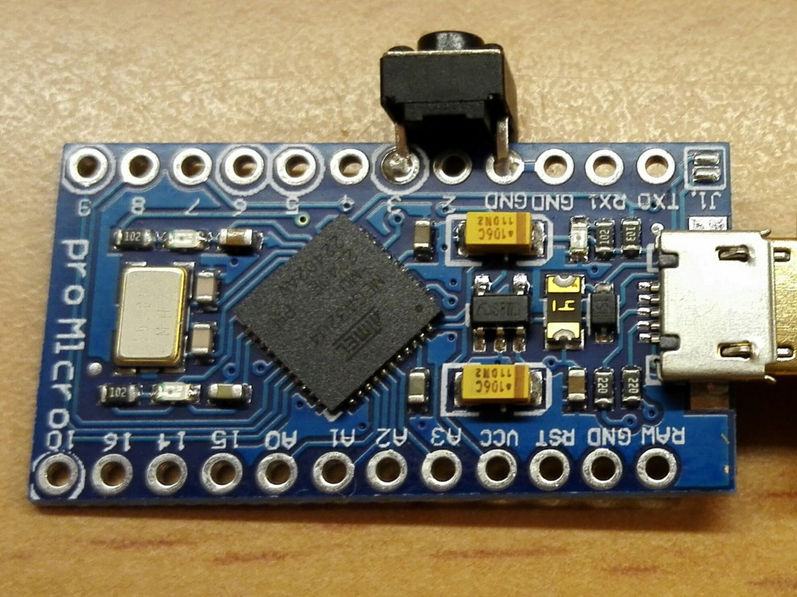

# arduino2-yksim

Simulate Yubikey with Atmel Mega32u4 based Arduino Boards (Leonardo, Micro, Pro Micro).

This is the successor of the original [arduino-yksim](https://github.com/pagong/arduino-yksim).
This new version should be compatible with the Arduino-IDE 2.x.

## Preparation

You need to add a push button between GND and a digital IO pin of your Arduino Board.
I've soldered one to Pin 3 and GND of a cheap 'Pro Micro' board, found on the _Internet_.

## How-to use

Copy the content of this directory as directory `YKsim` into the libraries directory of your Arduino-2.x installation.

Start the Ardunio GUI and open the `yksEEinit0` files (in File --> Examples --> YKsim).
You can either select one of the demo settings (by defining `YKS_EEINIT` as 1, 2, 3 or 4).
For production you should _really_ create your own **private** keys and define them in section 4 of file `yksEEinit.h`.
Change the AES-128 key, the public and private ids and the static password to your personal likings (and keep them private).
Upload the code to your Arduino Board. This needs to be done once, whenever you change your keys.

Then open the file `yksButton1` (also in File --> Examples --> YKsim) and check for the correct IO pin definition.
Then upload this code to your Board and connect it to an USB port of your computer.
This will turn your Board into an USB keyboard that emits keyboard scan codes whenever you press the button.
Every time you press the button for a short time, a unique new Yubikey compatible OTP will be 'typed' by the Board.
If you press the button for a longer time, the static, secret password will by 'typed' by the Board.

## Have a lot of Fun !

# Caveat
I'm using this Arduino code with Linux systems only. 
I've no idea whether this stuff works with Macintosh or Windows systems.
